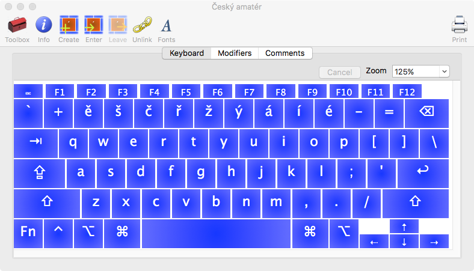
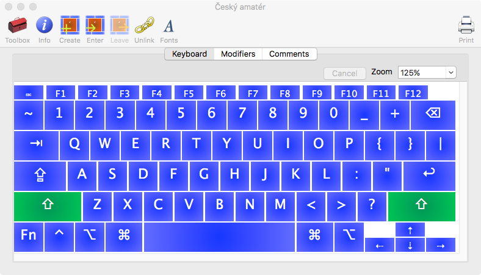
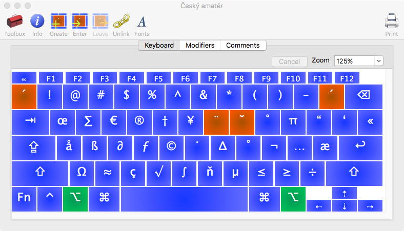
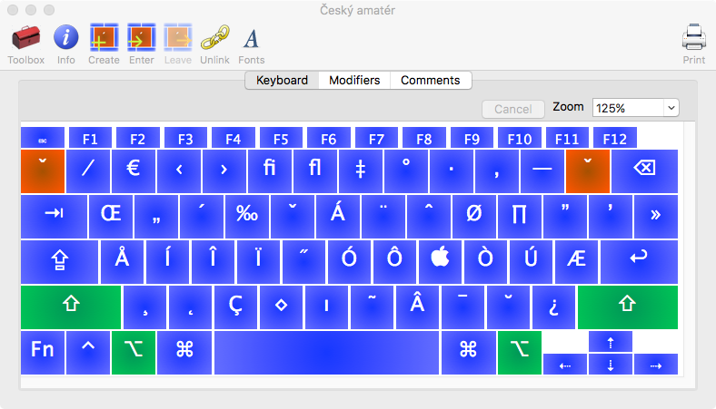

# Klávesové rozložení "Český amatér"

Nebaví vás přepínat mezi anglickým rozložením pro programování a českým pro
běžné psaní? Rezignujete a pisete bez hacku a carek? Už zase stačí jen jedno rozložení!

## Mac

- instalátor: [Czech_amateur_OSX.dmg](mac/installer/Czech_amateur_OSX_0.2.dmg)
- zdroj (bundle): [Czech amateur.bundle](mac/installer/src/)
  - XML, lze editovat v [Ukulele](http://scripts.sil.org/ukelele)
- [dokumentace (obrázky, PDF)](mac/docs/)

Features:

- qwerty klávesnice
- anglické speciální znaky pro programování
- horní řádka:
  - bez modifikátorů: české znaky
  - SHIFT: číslice (stejně jako CZ, na EN bez SHIFTu)
  - OPTION: `!@#$%^&*()` (na EN bez SHIFTem)
- nabodeníčka (dead keys):
  - `OPTION + =`: čárka
    - funguje i jako háček
  - `SHIFT + OPTION + =`: háček/kroužek
    - pro `u` funguje i jako koužek
  - `OPTION + u`: umlaut
- správně funguje i CAPS LOCK

## Windows

- 2010
- instalátor + definice: [czech-amateur-keyboard-layout_windows7_2010-08-22.zip](windows/czech-amateur-keyboard-layout_windows7_2010-08-22.zip)
- vytvořeno pomocí nástroje [Microsoft Keyboard Layout Creator](https://www.microsoft.com/en-us/download/details.aspx?id=22339).
- fungovalo na Windows 7, mohlo by na XP, 2003, Vista
- Windows 8 a 10 - netestováno
  - TODO: vyzkoušet http://www.klm32.com/

## Linux (X)

- 2005
- [dokumentace](linux/cz-amater-2005/README.md)
- [kód je ve formě patchů pro konfiguráky X](linux/cz-amater-2005/)

## Licence

- Autor: Bohumír Zámečník
- Licence: MIT

## Historie

V časech Windows 95/98 od [Michala Mareše](http://www.neo.cz/~tomas/csklavesnice/klavesnice_w9x.html), které se už ztratilo. Spojovalo dohromady anglické qwerty rozložení se speciálními znaky pro programování s českými znaky v horní liště. Bylo moc příjemné, proto mi při přechodu na Windows XP chybělo. Pro Windows 2000/XP stvořil něco podobného [Tomáš Kouba - csklavesnice](http://www.neo.cz/~tomas/csklavesnice/) a [Martin Koníček - kbdcza](http://www.volny.cz/martin.konicek/kbdcza/) (oboje už je pryč). Pro Windows 7 jsem si v roce 2010 [jedno udělal sám](https://www.dropbox.com/sh/6rkoubtpoc1fsje/j4jKV40ZoN/czech-amateur-keyboard-layout_windows7_2010-08-22.zip).

[Chybělo mi i pro Linux](http://www.abclinuxu.cz/blog/bohous/2005/11/cesky-amater-klavesove-rozlozeni). Jednu vytvořil [Yeti](http://trific.ath.cx/resources/czech-x-keyboard/), jednu jsem si taky v roce 2005 [připravil sám](http://www.abclinuxu.cz/blog/bohous/2005/12/klavesnice-cesky-amater-hotovo). Obojí jsou už asi ztracené.

V roce 2012 jsem přešel na Mac a nějak rezignoval a od té doby přepínám mezi EN/CZ. Občas je to dost na palici. V červenci 2018 jsem narazil na nástroj [Ukulele](http://scripts.sil.org/ukelele) a za večer znovu oživil Českého amatéra na Macu.

Btw: http://www.ceskaklavesnice.cz/ - web o české počítačové klávesnici.
